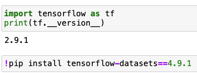

# How can I install Tensorflow locally?

### Prerequisite:
- Conda environment set up and able to run notebooks locally (see [guideline](../run-jupyter-notebooks-locally))

### Steps

We recommend creating a new Conda environment for this exercise using Python 3.9, 3.10 or 3.11 as this has been tested with these Python versions. (We do not recommend Python 3.12)


1. Create a new Conda environment with matplotlib, scikit-learn and notebook using one of the mentioned Python versions: hhz-tf-py39

In addition, follow these steps to install tensorflow and tensorflow-datasets in your environment:

### Install tensorflow

1. Install the latest version of tensorflow using Conda in the Anaconda navigator (e.g. 2.9.1)


2. Open your notebook and check the installed versions (if any)

You may need to restart your kernel if it was already running.

```
import tensorflow as tf
print(tf.__version__)
```


### Install tensorflow datasets

At the time of writing, the most recent version of tensorflow-datasets that is compatible with Python 3.9 has not yet been published to the default Conda channel. We therefore install this package via pip directly.

1. Update or install `tensorflow-datasets` via the commands from within your notebook as needed:
```
!pip install tensorflow-datasets==4.9.1
```



```
import tensorflow_datasets as tfds
print(tfds.__version__)
```


2. Restart your Kernel via (Kernel > Restart) and check if the installation succeeded 


